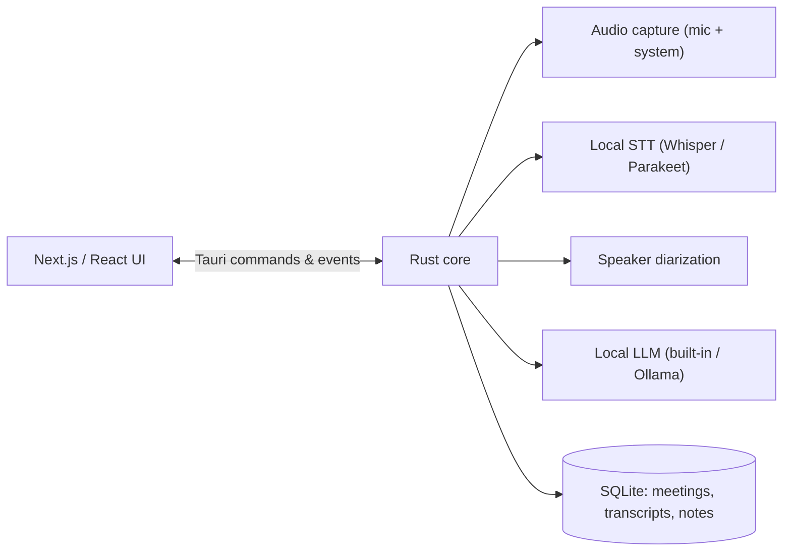

<p align="center">
  
</p>

<p align="center">
  <a href="https://github.com/praveenvnktsh/minutes/releases/latest"></a>
  
  
  
  
  
</p>

<p align="center">
  <b>Minutes</b> records your meetings, transcribes them locally, and writes clean notes that build on the notes you already took.<br/>
  Audio, transcripts, notes, and summaries stay on your machine unless you explicitly configure an external AI provider.
</p>

---

## Screenshots

<p align="center">
  
</p>

<p align="center">
  
  
</p>

---

## Why Minutes

- **Notes-first, not a report generator.** You jot down what matters; Minutes enriches those exact notes from the transcript instead of dumping a generic template on you.
- **Everything on-device.** Whisper/Parakeet transcription, speaker diarization, and local summary models. No account, no cloud.
- **One screen from start to finish.** Hit record and the meeting workspace opens immediately — notes, live transcript, and chat live together with a floating record bar.

## Features

### Capture
- Record **microphone + system audio** together with professional mixing and clipping protection.
- **Live transcription** on demand, or transcribe after the meeting to stay light on CPU.
- Voice Activity Detection so only speech reaches the model.
- Detect supported meetings and offer to start recording automatically.
- Menu-bar state for idle, recording, and paused.

### The meeting workspace
- A single workspace from the moment you hit record — with a **floating record bar**.
- **Live notes** you can type during the call, persisted continuously.
- **Raw notes stayed editable** after the meeting, side by side with the transcript.
- **Live transcript dock** with search and color-coded speaker chips.
- **Ask your meeting**: a chat that can reference the transcript and your notes.
- **Collapsible** navigation rail and transcript/chat dock.
- **Responsive**: narrow windows collapse the rail and dock the transcript/chat at the bottom.
- **Light and dark** themes.

### Notes and summaries
- **Enhanced notes** as concise, skimmable bullet points that **build on your own notes** — keeping your wording and order while adding specifics from the transcript.
- **No templates**, no rigid sections. Free-form notes that read like yours.
- The model **names the meeting** from the notes; the title stays inline editable.
- **Re-enhance** any time with one click; stop an in-flight generation.
- Optional per-meeting **summary language**.

### Transcription and models
- **Whisper.cpp / whisper-rs** and **NVIDIA Parakeet** paths, running locally.
- **GPU acceleration**: Metal + CoreML (macOS), CUDA/Vulkan (Windows), CPU fallback.
- **Built-in AI** summary models plus **Ollama** for local summarization.
- Optional external providers (**Claude, Groq, OpenRouter**) when you configure them.
- **Speaker diarization** with an editable speaker manager and reassignment.
- **Import audio** and retranscribe; background transcription queue.

### Data
- Meetings, transcripts, and summaries stored locally in **SQLite**.
- Full-text transcript search and a meetings list with dates.
- Signed desktop updates.

## Download

Click to download the latest version directly:

| Platform | Download |
| --- | --- |
| **macOS** (Apple Silicon) | [**minutes-macos-arm64.dmg**](https://github.com/praveenvnktsh/minutes/releases/latest/download/minutes-macos-arm64.dmg) |
| **Windows** (x64) | [**minutes-windows-x64-setup.exe**](https://github.com/praveenvnktsh/minutes/releases/latest/download/minutes-windows-x64-setup.exe) · [.msi](https://github.com/praveenvnktsh/minutes/releases/latest/download/minutes-windows-x64.msi) |

All releases and notes: [github.com/praveenvnktsh/minutes/releases/latest](https://github.com/praveenvnktsh/minutes/releases/latest).
Minutes ships installers for macOS and Windows only. Linux is unsupported: the release pipeline publishes no Linux artifact, and the audio capture layer (ALSA/PulseAudio) is not regularly tested. Building from source on Linux still works and is documented below, for contributors.

> **macOS first launch:** Minutes isn't notarized yet, so macOS may warn that it "could not verify it is free of malware". To open it, **right-click the app → Open → Open**, or run `xattr -dr com.apple.quarantine /Applications/minutes.app` once.

## Quick start

Install Rust, Node.js, pnpm 9.15.9, and your platform's native build tools. On macOS install Xcode and select it with `xcode-select`.

```bash
git clone https://github.com/praveenvnktsh/minutes.git
cd minutes/frontend
pnpm install --frozen-lockfile
pnpm tauri:dev
```

Local Apple Silicon production bundle with Metal:

```bash
cd frontend
pnpm tauri:build:local:mac
```

See [docs/BUILDING.md](docs/BUILDING.md) for platform details, and [docs/building_in_linux.md](docs/building_in_linux.md) for the unsupported, source-only Linux build.

## Architecture



Minutes is a Tauri 2 desktop app: a Next.js/React interface inside a Rust core. Rust handles audio capture, local inference, persistence, notifications, meeting detection, and updates; all meeting data lives in a local SQLite database. See [docs/architecture.md](docs/architecture.md).

## Privacy

Usage telemetry is disabled and no analytics destination is configured. Audio, transcripts, notes, and summaries stay on your machine. If you configure an external AI provider, the data sent to it is governed by that provider's terms and your configuration. Read the [privacy policy](PRIVACY_POLICY.md).

## Updates

The desktop updater reads signed manifests from this repository's releases:

`https://github.com/praveenvnktsh/minutes/releases/latest/download/latest.json`

Release artifacts are signed with this fork's Tauri updater key; the private key lives outside the repository and in CI secrets.

## Contributing

Issues and pull requests are welcome — see [CONTRIBUTING.md](CONTRIBUTING.md).

## License and acknowledgments

Minutes is distributed under the [MIT License](LICENSE.md). The original MIT copyright notice is retained as required by that license. Third-party code, libraries, and models retain their respective licenses and attribution.

Built on open-source work including [whisper.cpp](https://github.com/ggerganov/whisper.cpp), [Screenpipe](https://github.com/mediar-ai/screenpipe), and NVIDIA Parakeet model tooling.
