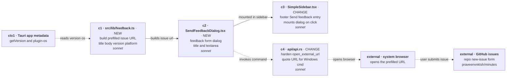

```mermaid
flowchart LR
  ext1["<b>external · GitHub issues</b><br/>repo new-issue form<br/>praveenvnktsh/minutes"]
  ext2["<b>external · system browser</b><br/>opens the prefilled URL"]
  ctx1["<b>ctx1 · Tauri app metadata</b><br/>getVersion and plugin-os"]

  c1["<b>c1 · src/lib/feedback.ts</b> · NEW<br/>build prefilled issue URL<br/>title body version platform<br/><i>sonnet</i>"]
  c2["<b>c2 · SendFeedbackDialog.tsx</b> · NEW<br/>feedback form dialog<br/>title and textarea<br/><i>sonnet</i>"]
  c3["<b>c3 · SimpleSidebar.tsx</b> · CHANGE<br/>footer Send feedback entry<br/>mounts dialog on click<br/><i>sonnet</i>"]
  c4["<b>c4 · api/api.rs</b> · CHANGE<br/>harden open_external_url<br/>quote URL for Windows cmd<br/><i>sonnet</i>"]

  ctx1 -.->|"reads version os"| c1
  c1 -->|"builds issue url"| c2
  c2 -->|"mounted in sidebar"| c3
  c2 -.->|"invokes command"| c4
  c4 -.->|"opens browser"| ext2
  ext2 -.->|"user submits issue"| ext1
```
