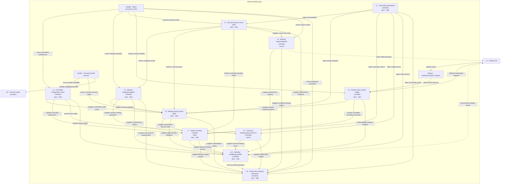

```mermaid
flowchart TD
  os["os · Desktop OS"]
  llm["llm · External model providers"]

  subgraph app["Minutes desktop app"]
    storage["storage · Native persistence APIs"]
    engines["engines · Audio/transcription engines"]
    models["models · Summary/model services"]

    c1["c1 · Visual tokens/primitives<br/>CHANGE<br/>opus · high"]
    c2["c2 · Committed configuration owner<br/>CHANGE<br/>opus · high"]
    c3["c3 · Meeting catalog/navigation<br/>CHANGE<br/>opus · high"]
    c4["c4 · Note persistence owner<br/>NEW<br/>opus · high"]
    c5["c5 · Scoped native activity bridge<br/>CHANGE<br/>opus · high"]
    c6["c6 · Meeting activity owner<br/>NEW<br/>opus · high"]
    c7["c7 · Global recording controller<br/>NEW<br/>opus · high"]
    c8["c8 · Meeting export/clipboard<br/>CHANGE<br/>sonnet"]
    c9["c9 · Canonical settings/quick-edit forms<br/>CHANGE<br/>sonnet"]
    c10["c10 · Meetings shell/library/palette<br/>CHANGE<br/>opus · high"]
    c11["c11 · Responsive meeting workspace<br/>CHANGE<br/>opus · high"]

    storage -->|"serves committed preferences"| c2
    storage -->|"serves meeting metadata"| c3
    storage -->|"persists note documents"| c4
    storage -->|"resolves session identity"| c5
    storage -->|"serves export content"| c8
    storage -->|"serves paginated transcripts"| c11
    engines -->|"reports native lifecycle"| c5
    models -->|"serves model availability"| c2
    models -->|"serves summary process status"| c6

    c1 -->|"styles note feedback"| c4
    c1 -->|"styles activity feedback"| c6
    c1 -->|"styles recording controls"| c7
    c1 -->|"styles settings forms"| c9
    c1 -->|"styles shell surfaces"| c10
    c1 -->|"styles accessible panels"| c11

    c2 -->|"supplies committed model policy"| c6
    c2 -->|"supplies recording preferences"| c7
    c2 -->|"commits form drafts"| c9
    c2 -->|"supplies feature gates"| c10

    c3 -->|"supplies meeting identities"| c6
    c3 -->|"supplies session catalog operations"| c7
    c3 -->|"supplies scoped library search"| c10
    c3 -->|"supplies transactional meeting edits"| c11

    c4 -->|"flushes navigation drafts"| c3
    c4 -->|"flushes summary inputs"| c6
    c4 -->|"flushes recording transition drafts"| c7
    c4 -->|"supplies current raw notes"| c8
    c4 -->|"supplies editors/save feedback"| c11

    c5 -->|"supplies scoped snapshots/events"| c6
    c5 -->|"accepts correlated recording commands"| c7
    c5 -->|"acknowledges prompt requests"| c10
    c6 -->|"supplies authoritative lifecycle state"| c7
    c6 -->|"supplies global activity feedback"| c10
    c6 -->|"supplies meeting/task activity"| c11

    c7 -->|"supplies global recording actions"| c10
    c7 -->|"supplies identity scoped controls"| c11
    c8 -->|"supplies awaited link copying"| c10
    c8 -->|"supplies complete meeting export"| c11
    c9 -->|"supplies focused settings forms"| c10
    c9 -->|"supplies model quick editing"| c11
    c10 -.->|"mounts routed workspace"| c11
  end

  os -->|"supplies audio"| engines
  os -->|"delivers tray/window requests"| c5
  c10 -.->|"synchronizes window theme"| os
  c8 -.->|"writes clipboard/export"| os
  models -->|"invokes configured provider"| llm
```
