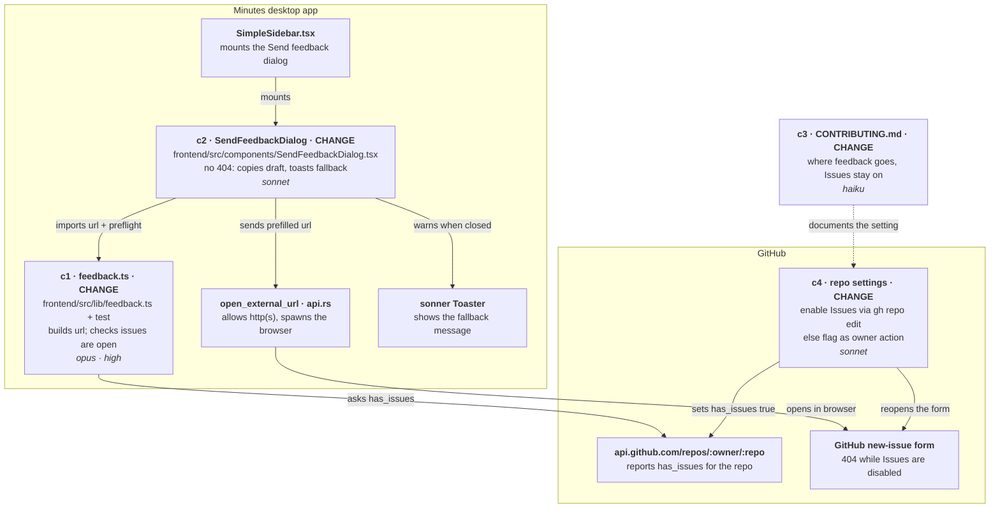

```mermaid
flowchart TD
  subgraph app["Minutes desktop app"]
    sidebar["<b>SimpleSidebar.tsx</b><br/>mounts the Send feedback dialog"]
    c2["<b>c2 · SendFeedbackDialog · CHANGE</b><br/>frontend/src/components/SendFeedbackDialog.tsx<br/>no 404: copies draft, toasts fallback<br/><i>sonnet</i>"]
    c1["<b>c1 · feedback.ts · CHANGE</b><br/>frontend/src/lib/feedback.ts + test<br/>builds url; checks issues are open<br/><i>opus · high</i>"]
    openurl["<b>open_external_url · api.rs</b><br/>allows http(s), spawns the browser"]
    toaster["<b>sonner Toaster</b><br/>shows the fallback message"]
  end
  subgraph gh["GitHub"]
    ghapi["<b>api.github.com/repos/:owner/:repo</b><br/>reports has_issues for the repo"]
    form["<b>GitHub new-issue form</b><br/>404 while Issues are disabled"]
    c4["<b>c4 · repo settings · CHANGE</b><br/>enable Issues via gh repo edit<br/>else flag as owner action<br/><i>sonnet</i>"]
  end
  c3["<b>c3 · CONTRIBUTING.md · CHANGE</b><br/>where feedback goes, Issues stay on<br/><i>haiku</i>"]

  sidebar -->|"mounts"| c2
  c2 -->|"imports url + preflight"| c1
  c1 -->|"asks has_issues"| ghapi
  c2 -->|"sends prefilled url"| openurl
  c2 -->|"warns when closed"| toaster
  openurl -->|"opens in browser"| form
  c4 -->|"sets has_issues true"| ghapi
  c4 -->|"reopens the form"| form
  c3 -.->|"documents the setting"| c4
```
