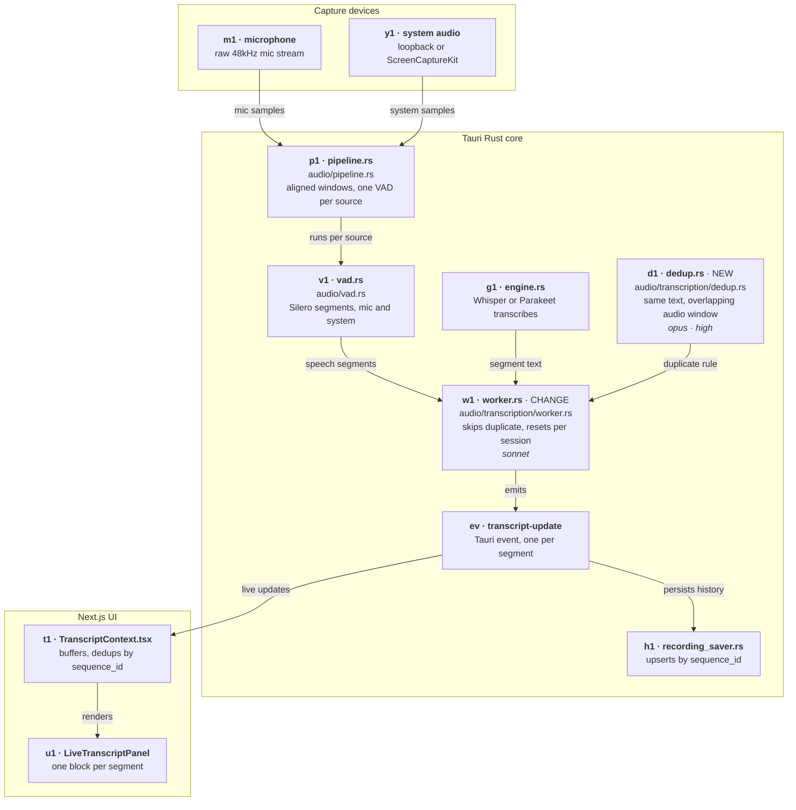

```mermaid
flowchart TD
  subgraph devices["Capture devices"]
    m1["<b>m1 · microphone</b><br/>raw 48kHz mic stream"]
    y1["<b>y1 · system audio</b><br/>loopback or ScreenCaptureKit"]
  end

  subgraph core["Tauri Rust core"]
    p1["<b>p1 · pipeline.rs</b><br/>audio/pipeline.rs<br/>aligned windows, one VAD per source"]
    v1["<b>v1 · vad.rs</b><br/>audio/vad.rs<br/>Silero segments, mic and system"]
    g1["<b>g1 · engine.rs</b><br/>Whisper or Parakeet transcribes"]
    d1["<b>d1 · dedup.rs</b> · NEW<br/>audio/transcription/dedup.rs<br/>same text, overlapping audio window<br/><i>opus · high</i>"]
    w1["<b>w1 · worker.rs</b> · CHANGE<br/>audio/transcription/worker.rs<br/>skips duplicate, resets per session<br/><i>sonnet</i>"]
    ev["<b>ev · transcript-update</b><br/>Tauri event, one per segment"]
    h1["<b>h1 · recording_saver.rs</b><br/>upserts by sequence_id"]
  end

  subgraph ui["Next.js UI"]
    t1["<b>t1 · TranscriptContext.tsx</b><br/>buffers, dedups by sequence_id"]
    u1["<b>u1 · LiveTranscriptPanel</b><br/>one block per segment"]
  end

  m1 -->|"mic samples"| p1
  y1 -->|"system samples"| p1
  p1 -->|"runs per source"| v1
  v1 -->|"speech segments"| w1
  g1 -->|"segment text"| w1
  d1 -->|"duplicate rule"| w1
  w1 -->|"emits"| ev
  ev -->|"persists history"| h1
  ev -->|"live updates"| t1
  t1 -->|"renders"| u1
```
