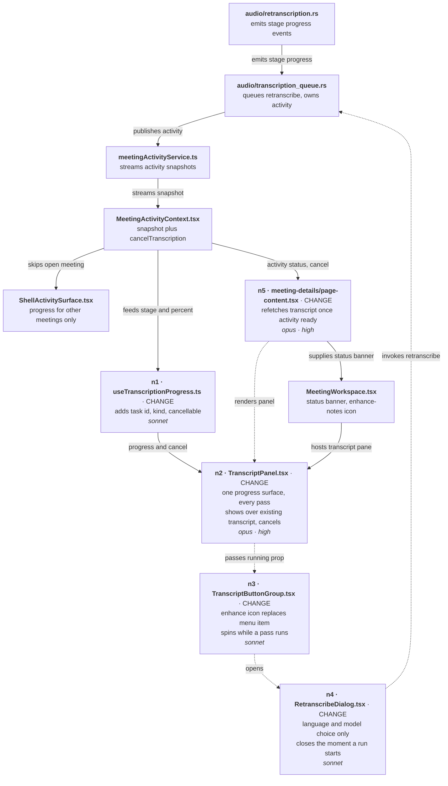

```mermaid
flowchart TD
  rt["<b>audio/retranscription.rs</b><br/>emits stage progress events"]
  q["<b>audio/transcription_queue.rs</b><br/>queues retranscribe, owns activity"]
  svc["<b>meetingActivityService.ts</b><br/>streams activity snapshots"]
  ctx["<b>MeetingActivityContext.tsx</b><br/>snapshot plus cancelTranscription"]
  ws["<b>MeetingWorkspace.tsx</b><br/>status banner, enhance-notes icon"]
  shell["<b>ShellActivitySurface.tsx</b><br/>progress for other meetings only"]

  n1["<b>n1 · useTranscriptionProgress.ts</b> · CHANGE<br/>adds task id, kind, cancellable<br/><i>sonnet</i>"]
  n2["<b>n2 · TranscriptPanel.tsx</b> · CHANGE<br/>one progress surface, every pass<br/>shows over existing transcript, cancels<br/><i>opus · high</i>"]
  n3["<b>n3 · TranscriptButtonGroup.tsx</b> · CHANGE<br/>enhance icon replaces menu item<br/>spins while a pass runs<br/><i>sonnet</i>"]
  n4["<b>n4 · RetranscribeDialog.tsx</b> · CHANGE<br/>language and model choice only<br/>closes the moment a run starts<br/><i>sonnet</i>"]
  n5["<b>n5 · meeting-details/page-content.tsx</b> · CHANGE<br/>refetches transcript once activity ready<br/><i>opus · high</i>"]

  rt -->|"emits stage progress"| q
  q -->|"publishes activity"| svc
  svc -->|"streams snapshot"| ctx
  ctx -->|"feeds stage and percent"| n1
  ctx -->|"activity status, cancel"| n5
  ctx -->|"skips open meeting"| shell
  n1 -->|"progress and cancel"| n2
  n2 -.->|"passes running prop"| n3
  n3 -.->|"opens"| n4
  n4 -.->|"invokes retranscribe"| q
  n5 -.->|"renders panel"| n2
  n5 -->|"supplies status banner"| ws
  ws -->|"hosts transcript pane"| n2
```
