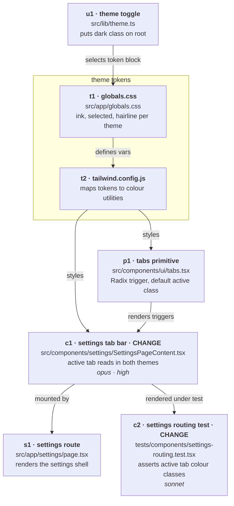

```mermaid
flowchart TD
  u1["<b>u1 · theme toggle</b><br/>src/lib/theme.ts<br/>puts dark class on root"]

  subgraph tokens["theme tokens"]
    t1["<b>t1 · globals.css</b><br/>src/app/globals.css<br/>ink, selected, hairline per theme"]
    t2["<b>t2 · tailwind.config.js</b><br/>maps tokens to colour utilities"]
  end

  p1["<b>p1 · tabs primitive</b><br/>src/components/ui/tabs.tsx<br/>Radix trigger, default active class"]

  c1["<b>c1 · settings tab bar · CHANGE</b><br/>src/components/settings/SettingsPageContent.tsx<br/>active tab reads in both themes<br/><i>opus · high</i>"]

  c2["<b>c2 · settings routing test · CHANGE</b><br/>tests/components/settings-routing.test.tsx<br/>asserts active tab colour classes<br/><i>sonnet</i>"]

  s1["<b>s1 · settings route</b><br/>src/app/settings/page.tsx<br/>renders the settings shell"]

  u1 -->|"selects token block"| t1
  t1 -->|"defines vars"| t2
  t2 -->|"styles"| p1
  t2 -->|"styles"| c1
  p1 -->|"renders triggers"| c1
  c1 -->|"mounted by"| s1
  c1 -->|"rendered under test"| c2
```
