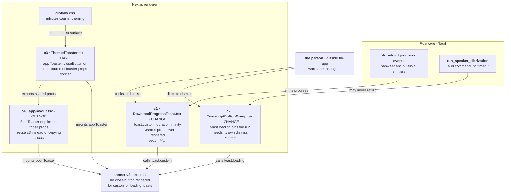

```mermaid
flowchart TD
  u1["<b>the person</b> · outside the app<br/>wants the toast gone"]

  subgraph core["Rust core · Tauri"]
    r1["<b>download progress events</b><br/>parakeet and builtin-ai emitters"]
    r2["<b>run_speaker_diarization</b><br/>Tauri command, no timeout"]
  end

  subgraph ui["Next.js renderer"]
    c1["<b>c1 · DownloadProgressToast.tsx</b> · CHANGE<br/>toast.custom, duration Infinity<br/>onDismiss prop never rendered<br/><i>opus · high</i>"]
    c2["<b>c2 · TranscriptButtonGroup.tsx</b> · CHANGE<br/>toast.loading pins the run<br/>needs its own dismiss<br/><i>sonnet</i>"]
    c3["<b>c3 · ThemedToaster.tsx</b> · CHANGE<br/>app Toaster, closeButton on<br/>one source of toaster props<br/><i>sonnet</i>"]
    c4["<b>c4 · app/layout.tsx</b> · CHANGE<br/>BootToaster duplicates those props<br/>reuse c3 instead of copying<br/><i>sonnet</i>"]
    x2["<b>globals.css</b><br/>minutes-toaster theming"]
  end

  x1["<b>sonner v2</b> · external<br/>no close button rendered<br/>for custom or loading toasts"]

  u1 -->|"clicks to dismiss"| c1
  u1 -->|"clicks to dismiss"| c2
  r1 -->|"emits progress"| c1
  r2 -->|"may never return"| c2
  x2 -->|"themes toast surface"| c3
  c3 -->|"exports shared props"| c4
  c1 -->|"calls toast.custom"| x1
  c2 -->|"calls toast.loading"| x1
  c3 -->|"mounts app Toaster"| x1
  c4 -->|"mounts boot Toaster"| x1
```
