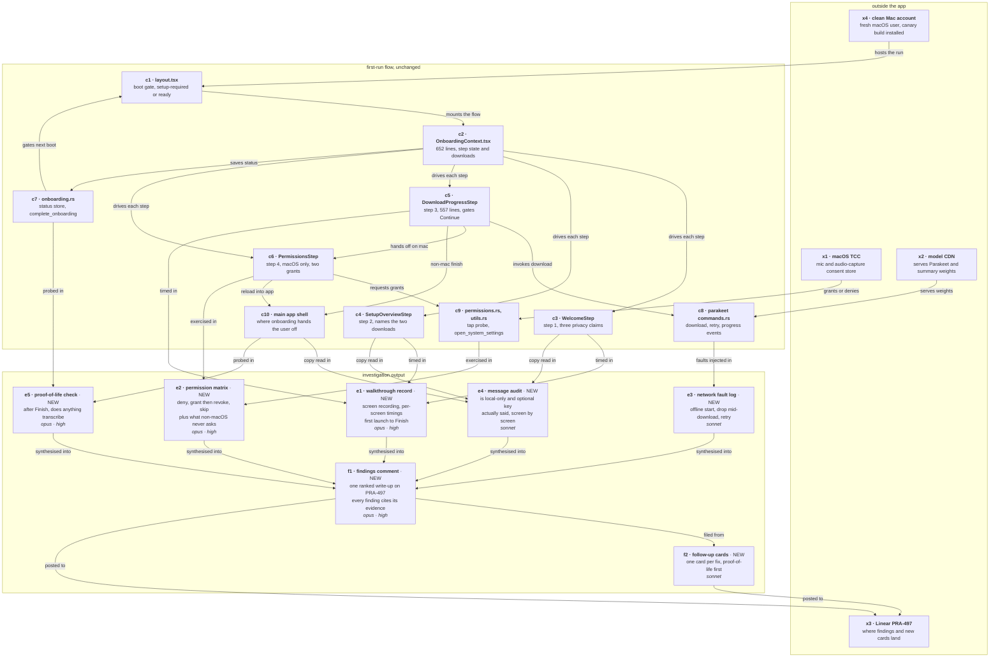

```mermaid
flowchart TD
  subgraph EXT["outside the app"]
    x4["<b>x4 · clean Mac account</b><br/>fresh macOS user, canary build installed"]
    x1["<b>x1 · macOS TCC</b><br/>mic and audio-capture consent store"]
    x2["<b>x2 · model CDN</b><br/>serves Parakeet and summary weights"]
    x3["<b>x3 · Linear PRA-497</b><br/>where findings and new cards land"]
  end

  subgraph APP["first-run flow, unchanged"]
    c1["<b>c1 · layout.tsx</b><br/>boot gate, setup-required or ready"]
    c2["<b>c2 · OnboardingContext.tsx</b><br/>652 lines, step state and downloads"]
    c3["<b>c3 · WelcomeStep</b><br/>step 1, three privacy claims"]
    c4["<b>c4 · SetupOverviewStep</b><br/>step 2, names the two downloads"]
    c5["<b>c5 · DownloadProgressStep</b><br/>step 3, 557 lines, gates Continue"]
    c6["<b>c6 · PermissionsStep</b><br/>step 4, macOS only, two grants"]
    c7["<b>c7 · onboarding.rs</b><br/>status store, complete_onboarding"]
    c8["<b>c8 · parakeet commands.rs</b><br/>download, retry, progress events"]
    c9["<b>c9 · permissions.rs, utils.rs</b><br/>tap probe, open_system_settings"]
    c10["<b>c10 · main app shell</b><br/>where onboarding hands the user off"]
  end

  subgraph OUT["investigation output"]
    e1["<b>e1 · walkthrough record</b> · NEW<br/>screen recording, per-screen timings<br/>first launch to Finish<br/><i>opus · high</i>"]
    e2["<b>e2 · permission matrix</b> · NEW<br/>deny, grant then revoke, skip<br/>plus what non-macOS never asks<br/><i>opus · high</i>"]
    e3["<b>e3 · network fault log</b> · NEW<br/>offline start, drop mid-download, retry<br/><i>sonnet</i>"]
    e4["<b>e4 · message audit</b> · NEW<br/>is local-only and optional key<br/>actually said, screen by screen<br/><i>sonnet</i>"]
    e5["<b>e5 · proof-of-life check</b> · NEW<br/>after Finish, does anything transcribe<br/><i>opus · high</i>"]
    f1["<b>f1 · findings comment</b> · NEW<br/>one ranked write-up on PRA-497<br/>every finding cites its evidence<br/><i>opus · high</i>"]
    f2["<b>f2 · follow-up cards</b> · NEW<br/>one card per fix, proof-of-life first<br/><i>sonnet</i>"]
  end

  x4 -->|"hosts the run"| c1
  c1 -->|"mounts the flow"| c2
  c2 -->|"drives each step"| c3
  c2 -->|"drives each step"| c4
  c2 -->|"drives each step"| c5
  c2 -->|"drives each step"| c6
  c2 -->|"saves status"| c7
  c7 -->|"gates next boot"| c1
  c5 -->|"invokes download"| c8
  x2 -->|"serves weights"| c8
  c6 -->|"requests grants"| c9
  x1 -->|"grants or denies"| c9
  c5 -->|"hands off on mac"| c6
  c5 -->|"non-mac finish"| c10
  c6 -->|"reload into app"| c10

  c3 -->|"timed in"| e1
  c4 -->|"timed in"| e1
  c5 -->|"timed in"| e1
  c6 -->|"exercised in"| e2
  c9 -->|"exercised in"| e2
  c8 -->|"faults injected in"| e3
  c3 -->|"copy read in"| e4
  c4 -->|"copy read in"| e4
  c10 -->|"copy read in"| e4
  c10 -->|"probed in"| e5
  c7 -->|"probed in"| e5

  e1 -->|"synthesised into"| f1
  e2 -->|"synthesised into"| f1
  e3 -->|"synthesised into"| f1
  e4 -->|"synthesised into"| f1
  e5 -->|"synthesised into"| f1
  f1 -->|"filed from"| f2
  f1 -->|"posted to"| x3
  f2 -->|"posted to"| x3
```
