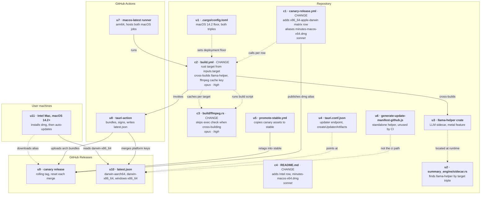

```mermaid
flowchart TD
  subgraph repo["Repository"]
    c1["<b>c1 · canary-release.yml</b> · CHANGE<br/>adds x86_64-apple-darwin matrix row<br/>aliases minutes-macos-x64.dmg<br/><i>sonnet</i>"]
    c2["<b>c2 · build.yml</b> · CHANGE<br/>rust target from inputs.target<br/>cross-builds llama-helper, ffmpeg cache key<br/><i>opus · high</i>"]
    c3["<b>c3 · build/ffmpeg.rs</b> · CHANGE<br/>skips exec check when cross-building<br/><i>opus · high</i>"]
    c4["<b>c4 · README.md</b> · CHANGE<br/>adds Intel row, minutes-macos-x64.dmg<br/><i>sonnet</i>"]
    u1["<b>u1 · .cargo/config.toml</b><br/>macOS 14.2 floor, both triples"]
    u2["<b>u2 · summary_engine/sidecar.rs</b><br/>finds llama-helper by target triple"]
    u3["<b>u3 · llama-helper crate</b><br/>LLM sidecar, metal feature"]
    u4["<b>u4 · tauri.conf.json</b><br/>updater endpoint, createUpdaterArtifacts"]
    u5["<b>u5 · promote-stable.yml</b><br/>copies canary assets to stable"]
    u6["<b>u6 · generate-update-manifest-github.js</b><br/>standalone helper, unused by CI"]
  end
  subgraph ci["GitHub Actions"]
    u7["<b>u7 · macos-latest runner</b><br/>arm64, hosts both macOS jobs"]
    u8["<b>u8 · tauri-action</b><br/>bundles, signs, writes latest.json"]
  end
  subgraph rel["GitHub Releases"]
    u9["<b>u9 · canary release</b><br/>rolling tag, reset each merge"]
    u10["<b>u10 · latest.json</b><br/>darwin-aarch64, darwin-x86_64, windows-x86_64"]
  end
  subgraph client["User machines"]
    u11["<b>u11 · Intel Mac, macOS 14.2+</b><br/>installs dmg, then auto-updates"]
  end
  u7 -->|"runs"| c2
  c1 -.->|"calls per row"| c2
  u1 -.->|"sets deployment floor"| c2
  c2 -->|"cross-builds"| u3
  u3 -.->|"located at runtime"| u2
  c2 -.->|"runs build script"| c3
  c2 -.->|"caches per target"| c3
  c2 -->|"invokes"| u8
  u8 -->|"uploads arch bundles"| u9
  u8 -->|"merges platform keys"| u10
  c1 -->|"publishes dmg alias"| u9
  u5 -->|"retags into stable"| u9
  u6 -.->|"not the ci path"| u10
  u4 -.->|"points at"| u10
  u11 -->|"reads darwin-x86_64"| u10
  u11 -.->|"downloads alias"| u9
```
