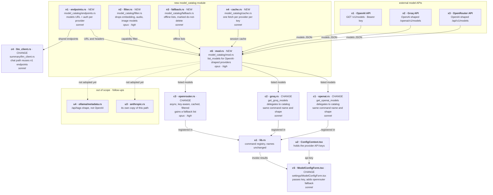

```mermaid
flowchart TD
  subgraph ext["external model APIs"]
    x1["<b>x1 · OpenAI API</b><br/>GET /v1/models · Bearer key"]
    x2["<b>x2 · Groq API</b><br/>OpenAI-shaped /openai/v1/models"]
    x3["<b>x3 · OpenRouter API</b><br/>OpenAI-shaped /api/v1/models"]
  end

  subgraph sg["new model_catalog module"]
    n1["<b>n1 · endpoints.rs</b> · NEW<br/>model_catalog/endpoints.rs<br/>models URL + auth per provider<br/><i>sonnet</i>"]
    n2["<b>n2 · filter.rs</b> · NEW<br/>model_catalog/filter.rs<br/>drops embedding, audio, image models<br/><i>opus · high</i>"]
    n3["<b>n3 · fallback.rs</b> · NEW<br/>model_catalog/fallback.rs<br/>offline lists, marked do-not-delete<br/><i>sonnet</i>"]
    n4["<b>n4 · cache.rs</b> · NEW<br/>model_catalog/cache.rs<br/>one fetch per provider per key<br/><i>sonnet</i>"]
    n5["<b>n5 · mod.rs</b> · NEW<br/>model_catalog/mod.rs<br/>list_models for OpenAI-shaped providers<br/><i>opus · high</i>"]
  end

  c1["<b>c1 · openai.rs</b> · CHANGE<br/>get_openai_models delegates to catalog<br/>same command name and shape<br/><i>sonnet</i>"]
  c2["<b>c2 · groq.rs</b> · CHANGE<br/>get_groq_models delegates to catalog<br/>same command name and shape<br/><i>sonnet</i>"]
  c3["<b>c3 · openrouter.rs</b> · CHANGE<br/>async, key-aware, cached, filtered<br/>gains a fallback list<br/><i>opus · high</i>"]
  c4["<b>c4 · llm_client.rs</b> · CHANGE<br/>summary/llm_client.rs<br/>chat path reuses n1 endpoints<br/><i>sonnet</i>"]
  c5["<b>c5 · ModelConfigForm.tsx</b> · CHANGE<br/>settings/ModelConfigForm.tsx<br/>passes key, adds openrouter fallback<br/><i>sonnet</i>"]

  u1["<b>u1 · lib.rs</b><br/>command registry, names unchanged"]
  u2["<b>u2 · ConfigContext.tsx</b><br/>holds the provider API keys"]

  subgraph oos["out of scope · follow-ups"]
    u3["<b>u3 · anthropic.rs</b><br/>its own copy of this path"]
    u4["<b>u4 · ollama/metadata.rs</b><br/>/api/tags shape, not OpenAI"]
  end

  x1 -->|"models JSON"| n5
  x2 -->|"models JSON"| n5
  x3 -->|"models JSON"| n5
  n1 -->|"URL and headers"| n5
  n2 -->|"capability filter"| n5
  n3 -->|"offline lists"| n5
  n4 -->|"session cache"| n5
  n1 -->|"shared endpoints"| c4
  n5 -->|"listed models"| c1
  n5 -->|"listed models"| c2
  n5 -->|"listed models"| c3
  c1 -->|"registered in"| u1
  c2 -->|"registered in"| u1
  c3 -->|"registered in"| u1
  u1 -->|"invoke results"| c5
  u2 -->|"api key"| c5
  n5 -.->|"not adopted yet"| u3
  n5 -.->|"not adopted yet"| u4
```
