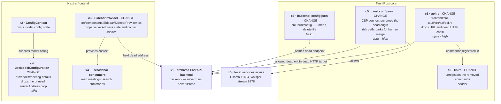

```mermaid
flowchart TD
  subgraph rust["Tauri Rust core"]
    c1["<b>c1 · api.rs</b> · CHANGE<br/>frontend/src-tauri/src/api/api.rs<br/>drops URL and dead HTTP chain<br/><i>opus · high</i>"]
    c2["<b>c2 · lib.rs</b> · CHANGE<br/>unregisters the removed commands<br/><i>sonnet</i>"]
    c5["<b>c5 · tauri.conf.json</b> · CHANGE<br/>CSP connect-src drops the dead origin<br/>risk path: parks for human merge<br/><i>opus · high</i>"]
    c6["<b>c6 · backend_config.json</b> · CHANGE<br/>src-tauri/config — unread, delete file<br/><i>haiku</i>"]
  end
  subgraph web["Next.js frontend"]
    c3["<b>c3 · SidebarProvider</b> · CHANGE<br/>src/components/Sidebar/SidebarProvider.tsx<br/>drops serverAddress state and context<br/><i>sonnet</i>"]
    c4["<b>c4 · useModelConfiguration</b> · CHANGE<br/>src/hooks/meeting-details<br/>drops the unused serverAddress prop<br/><i>haiku</i>"]
    x2["<b>x2 · ConfigContext</b><br/>owns model config state"]
    x4["<b>x4 · useSidebar consumers</b><br/>read meetings, search, summaries"]
  end
  x1["<b>x1 · archived FastAPI backend</b><br/>backend/ — never runs, never listens"]
  x5["<b>x5 · local services in use</b><br/>Ollama 11434, whisper stream 8178"]
  c1 -->|"dead HTTP target"| x1
  c1 -->|"commands registered in"| c2
  c3 -->|"held dead address"| x1
  c3 -->|"provides context"| x4
  x2 -->|"supplies model config"| c4
  c5 -->|"allowed dead origin"| x1
  c5 -->|"allows"| x5
  c6 -->|"names dead endpoint"| x1
```
