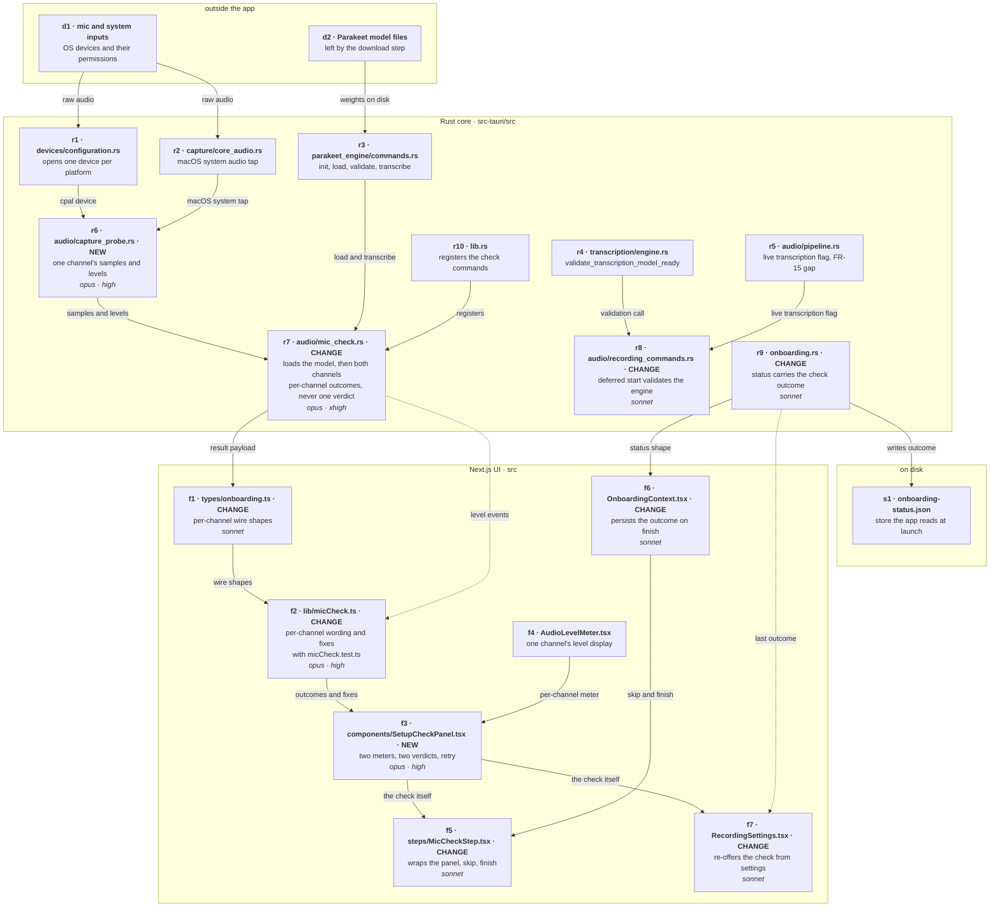

```mermaid
flowchart TD
  subgraph os["outside the app"]
    devices["<b>d1 · mic and system inputs</b><br/>OS devices and their permissions"]
    weights["<b>d2 · Parakeet model files</b><br/>left by the download step"]
  end

  subgraph rust["Rust core · src-tauri/src"]
    devcfg["<b>r1 · devices/configuration.rs</b><br/>opens one device per platform"]
    coreaudio["<b>r2 · capture/core_audio.rs</b><br/>macOS system audio tap"]
    parakeet["<b>r3 · parakeet_engine/commands.rs</b><br/>init, load, validate, transcribe"]
    engine["<b>r4 · transcription/engine.rs</b><br/>validate_transcription_model_ready"]
    pipe["<b>r5 · audio/pipeline.rs</b><br/>live transcription flag, FR-15 gap"]
    probe["<b>r6 · audio/capture_probe.rs · NEW</b><br/>one channel's samples and levels<br/><i>opus · high</i>"]
    check["<b>r7 · audio/mic_check.rs · CHANGE</b><br/>loads the model, then both channels<br/>per-channel outcomes, never one verdict<br/><i>opus · xhigh</i>"]
    reccmd["<b>r8 · audio/recording_commands.rs · CHANGE</b><br/>deferred start validates the engine<br/><i>sonnet</i>"]
    onb["<b>r9 · onboarding.rs · CHANGE</b><br/>status carries the check outcome<br/><i>sonnet</i>"]
    reg["<b>r10 · lib.rs</b><br/>registers the check commands"]
  end

  subgraph disk["on disk"]
    json["<b>s1 · onboarding-status.json</b><br/>store the app reads at launch"]
  end

  subgraph web["Next.js UI · src"]
    types["<b>f1 · types/onboarding.ts · CHANGE</b><br/>per-channel wire shapes<br/><i>sonnet</i>"]
    miclib["<b>f2 · lib/micCheck.ts · CHANGE</b><br/>per-channel wording and fixes<br/>with micCheck.test.ts<br/><i>opus · high</i>"]
    panel["<b>f3 · components/SetupCheckPanel.tsx · NEW</b><br/>two meters, two verdicts, retry<br/><i>opus · high</i>"]
    meter["<b>f4 · AudioLevelMeter.tsx</b><br/>one channel's level display"]
    step["<b>f5 · steps/MicCheckStep.tsx · CHANGE</b><br/>wraps the panel, skip, finish<br/><i>sonnet</i>"]
    ctx["<b>f6 · OnboardingContext.tsx · CHANGE</b><br/>persists the outcome on finish<br/><i>sonnet</i>"]
    settings["<b>f7 · RecordingSettings.tsx · CHANGE</b><br/>re-offers the check from settings<br/><i>sonnet</i>"]
  end

  devices -->|"raw audio"| devcfg
  devices -->|"raw audio"| coreaudio
  weights -->|"weights on disk"| parakeet
  devcfg -->|"cpal device"| probe
  coreaudio -->|"macOS system tap"| probe
  probe -->|"samples and levels"| check
  parakeet -->|"load and transcribe"| check
  reg -->|"registers"| check
  engine -->|"validation call"| reccmd
  pipe -->|"live transcription flag"| reccmd
  check -->|"result payload"| types
  types -->|"wire shapes"| miclib
  check -.->|"level events"| miclib
  miclib -->|"outcomes and fixes"| panel
  meter -->|"per-channel meter"| panel
  panel -->|"the check itself"| step
  panel -->|"the check itself"| settings
  ctx -->|"skip and finish"| step
  onb -->|"status shape"| ctx
  onb -->|"writes outcome"| json
  onb -.->|"last outcome"| settings
```
