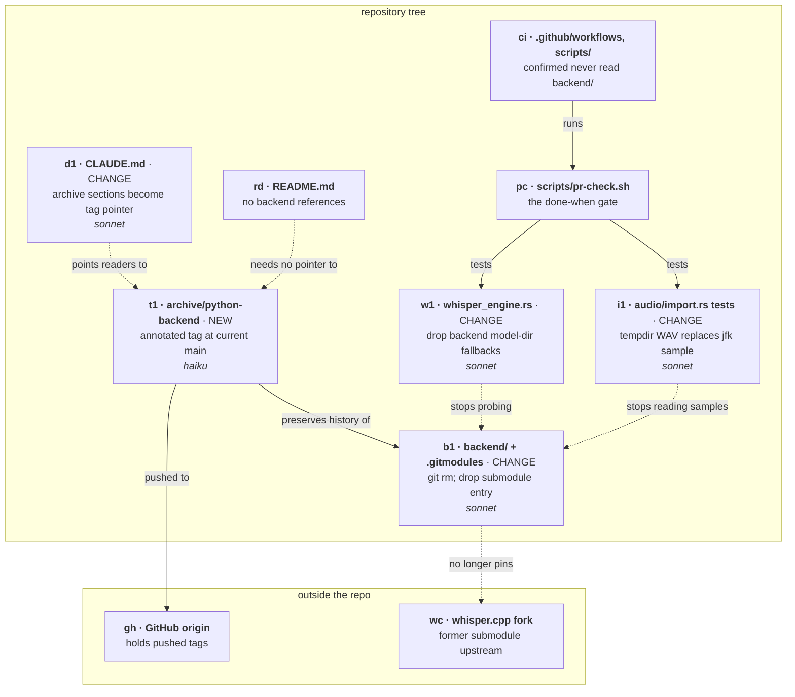

```mermaid
flowchart TD
  subgraph ext["outside the repo"]
    gh["<b>gh · GitHub origin</b><br/>holds pushed tags"]
    wcpp["<b>wc · whisper.cpp fork</b><br/>former submodule upstream"]
  end
  subgraph repo["repository tree"]
    t1["<b>t1 · archive/python-backend</b> · NEW<br/>annotated tag at current main<br/><i>haiku</i>"]
    b1["<b>b1 · backend/ + .gitmodules</b> · CHANGE<br/>git rm; drop submodule entry<br/><i>sonnet</i>"]
    d1["<b>d1 · CLAUDE.md</b> · CHANGE<br/>archive sections become tag pointer<br/><i>sonnet</i>"]
    w1["<b>w1 · whisper_engine.rs</b> · CHANGE<br/>drop backend model-dir fallbacks<br/><i>sonnet</i>"]
    i1["<b>i1 · audio/import.rs tests</b> · CHANGE<br/>tempdir WAV replaces jfk sample<br/><i>sonnet</i>"]
    rd["<b>rd · README.md</b><br/>no backend references"]
    ci["<b>ci · .github/workflows, scripts/</b><br/>confirmed never read backend/"]
    pc["<b>pc · scripts/pr-check.sh</b><br/>the done-when gate"]
  end
  t1 -->|"pushed to"| gh
  t1 -->|"preserves history of"| b1
  b1 -.->|"no longer pins"| wcpp
  d1 -.->|"points readers to"| t1
  w1 -.->|"stops probing"| b1
  i1 -.->|"stops reading samples"| b1
  ci -->|"runs"| pc
  pc -->|"tests"| w1
  pc -->|"tests"| i1
  rd -.->|"needs no pointer to"| t1
```
