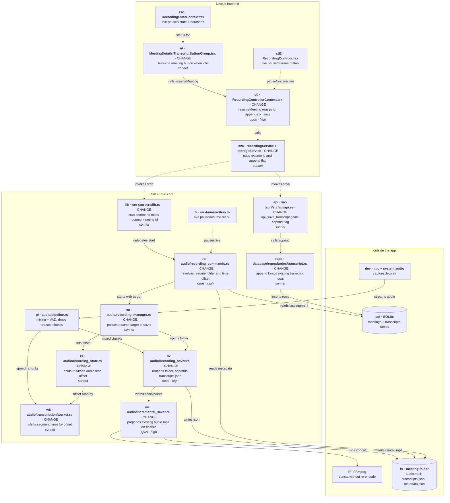

```mermaid
flowchart TD
  subgraph ext["outside the app"]
    dev["<b>dev · mic + system audio</b><br/>capture devices"]
    ff["<b>ff · FFmpeg</b><br/>concat without re-encode"]
    sql[("<b>sql · SQLite</b><br/>meetings + transcripts tables")]
    fs[("<b>fs · meeting folder</b><br/>audio.mp4, transcripts.json, metadata.json")]
  end

  subgraph rust["Rust / Tauri core"]
    lib["<b>lib · src-tauri/src/lib.rs</b> · CHANGE<br/>start command takes resume meeting id<br/><i>sonnet</i>"]
    rc["<b>rc · audio/recording_commands.rs</b> · CHANGE<br/>resolves resume folder and time offset<br/><i>opus · high</i>"]
    rm["<b>rm · audio/recording_manager.rs</b> · CHANGE<br/>passes resume target to saver<br/><i>sonnet</i>"]
    rs["<b>rs · audio/recording_state.rs</b> · CHANGE<br/>holds resumed audio time offset<br/><i>sonnet</i>"]
    wk["<b>wk · audio/transcription/worker.rs</b> · CHANGE<br/>shifts segment times by offset<br/><i>sonnet</i>"]
    sv["<b>sv · audio/recording_saver.rs</b> · CHANGE<br/>reopens folder, appends transcripts.json<br/><i>opus · high</i>"]
    inc["<b>inc · audio/incremental_saver.rs</b> · CHANGE<br/>prepends existing audio.mp4 on finalize<br/><i>opus · high</i>"]
    pl["<b>pl · audio/pipeline.rs</b><br/>mixing + VAD, drops paused chunks"]
    tr["<b>tr · src-tauri/src/tray.rs</b><br/>live pause/resume menu"]
    api["<b>api · src-tauri/src/api/api.rs</b> · CHANGE<br/>api_save_transcript gains append flag<br/><i>sonnet</i>"]
    repo["<b>repo · database/repositories/transcript.rs</b> · CHANGE<br/>append keeps existing transcript rows<br/><i>sonnet</i>"]
  end

  subgraph web["Next.js frontend"]
    svc["<b>svc · recordingService + storageService</b> · CHANGE<br/>pass resume id and append flag<br/><i>sonnet</i>"]
    ctl["<b>ctl · RecordingControllerContext.tsx</b> · CHANGE<br/>resumeMeeting reuses id, appends on save<br/><i>opus · high</i>"]
    ui["<b>ui · MeetingDetails/TranscriptButtonGroup.tsx</b> · CHANGE<br/>Resume meeting button when idle<br/><i>sonnet</i>"]
    rsc["<b>rsc · RecordingStateContext.tsx</b><br/>live paused state + durations"]
    ctl2["<b>ctl2 · RecordingControls.tsx</b><br/>live pause/resume button"]
  end

  dev -->|"streams audio"| pl
  pl -->|"speech chunks"| wk
  pl -->|"mixed chunks"| sv
  sv -->|"writes checkpoints"| inc
  inc -->|"runs concat"| ff
  inc -->|"writes audio.mp4"| fs
  sv -->|"writes json"| fs
  rs -->|"offset read by"| wk
  rc -->|"reads metadata"| fs
  rc -->|"reads last segment"| sql
  rc -->|"starts with target"| rm
  rm -->|"sets offset"| rs
  rm -->|"opens folder"| sv
  lib -->|"delegates start"| rc
  tr -.->|"pauses live"| rc
  repo -->|"inserts rows"| sql
  api -->|"calls append"| repo
  svc -.->|"invokes start"| lib
  svc -.->|"invokes save"| api
  ctl -->|"calls"| svc
  ui -->|"calls resumeMeeting"| ctl
  ctl2 -.->|"pause/resume live"| ctl
  rsc -->|"status for"| ui
```
