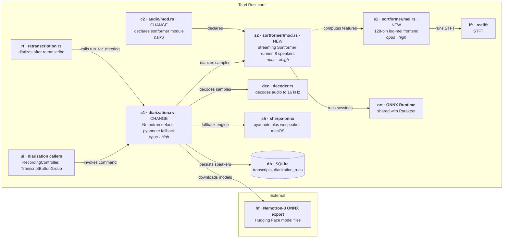

```mermaid
flowchart LR
  subgraph ext["External"]
    hf["<b>hf · Nemotron-3 ONNX export</b><br/>Hugging Face model files"]
  end
  subgraph app["Tauri Rust core"]
    ui["<b>ui · diarization callers</b><br/>RecordingController, TranscriptButtonGroup"]
    rt["<b>rt · retranscription.rs</b><br/>diarizes after retranscribe"]
    c1["<b>c1 · diarization.rs</b> · CHANGE<br/>Nemotron default, pyannote fallback<br/><i>opus · high</i>"]
    c2["<b>c2 · audio/mod.rs</b> · CHANGE<br/>declares sortformer module<br/><i>haiku</i>"]
    s2["<b>s2 · sortformer/mod.rs</b> · NEW<br/>streaming Sortformer runner, 8 speakers<br/><i>opus · xhigh</i>"]
    s1["<b>s1 · sortformer/mel.rs</b> · NEW<br/>128-bin log-mel frontend<br/><i>opus · high</i>"]
    dec["<b>dec · decoder.rs</b><br/>decodes audio to 16 kHz"]
    sh["<b>sh · sherpa-onnx</b><br/>pyannote plus wespeaker, macOS"]
    ort["<b>ort · ONNX Runtime</b><br/>shared with Parakeet"]
    fft["<b>fft · realfft</b><br/>STFT"]
    db[("<b>db · SQLite</b><br/>transcripts, diarization_runs")]
  end
  ui -->|"invokes command"| c1
  rt -->|"calls run_for_meeting"| c1
  c1 -->|"downloads models"| hf
  c1 -->|"decodes samples"| dec
  c1 -->|"diarizes samples"| s2
  c1 -->|"fallback engine"| sh
  c1 -->|"persists speakers"| db
  c2 -->|"declares"| s2
  s2 -.->|"computes features"| s1
  s2 -->|"runs sessions"| ort
  s1 -->|"runs STFT"| fft
```
