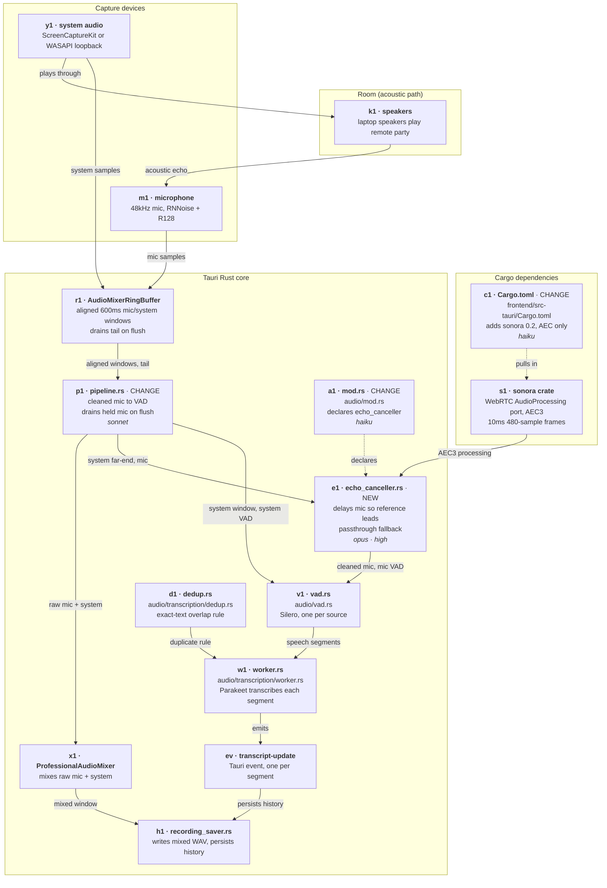

```mermaid
flowchart TD
  subgraph room["Room (acoustic path)"]
    k1["<b>k1 · speakers</b><br/>laptop speakers play remote party"]
  end

  subgraph devices["Capture devices"]
    m1["<b>m1 · microphone</b><br/>48kHz mic, RNNoise + R128"]
    y1["<b>y1 · system audio</b><br/>ScreenCaptureKit or WASAPI loopback"]
  end

  subgraph deps["Cargo dependencies"]
    c1["<b>c1 · Cargo.toml</b> · CHANGE<br/>frontend/src-tauri/Cargo.toml<br/>adds sonora 0.2, AEC only<br/><i>haiku</i>"]
    s1["<b>s1 · sonora crate</b><br/>WebRTC AudioProcessing port, AEC3<br/>10ms 480-sample frames"]
  end

  subgraph core["Tauri Rust core"]
    r1["<b>r1 · AudioMixerRingBuffer</b><br/>aligned 600ms mic/system windows<br/>drains tail on flush"]
    p1["<b>p1 · pipeline.rs</b> · CHANGE<br/>cleaned mic to VAD<br/>drains held mic on flush<br/><i>sonnet</i>"]
    e1["<b>e1 · echo_canceller.rs</b> · NEW<br/>delays mic so reference leads<br/>passthrough fallback<br/><i>opus · high</i>"]
    a1["<b>a1 · mod.rs</b> · CHANGE<br/>audio/mod.rs<br/>declares echo_canceller<br/><i>haiku</i>"]
    x1["<b>x1 · ProfessionalAudioMixer</b><br/>mixes raw mic + system"]
    h1["<b>h1 · recording_saver.rs</b><br/>writes mixed WAV, persists history"]
    v1["<b>v1 · vad.rs</b><br/>audio/vad.rs<br/>Silero, one per source"]
    w1["<b>w1 · worker.rs</b><br/>audio/transcription/worker.rs<br/>Parakeet transcribes each segment"]
    d1["<b>d1 · dedup.rs</b><br/>audio/transcription/dedup.rs<br/>exact-text overlap rule"]
    ev["<b>ev · transcript-update</b><br/>Tauri event, one per segment"]
  end

  y1 -->|"plays through"| k1
  k1 -->|"acoustic echo"| m1
  m1 -->|"mic samples"| r1
  y1 -->|"system samples"| r1
  r1 -->|"aligned windows, tail"| p1
  p1 -->|"raw mic + system"| x1
  x1 -->|"mixed window"| h1
  p1 -->|"system far-end, mic"| e1
  s1 -->|"AEC3 processing"| e1
  c1 -.->|"pulls in"| s1
  a1 -.->|"declares"| e1
  e1 -->|"cleaned mic, mic VAD"| v1
  p1 -->|"system window, system VAD"| v1
  v1 -->|"speech segments"| w1
  d1 -->|"duplicate rule"| w1
  w1 -->|"emits"| ev
  ev -->|"persists history"| h1
```
