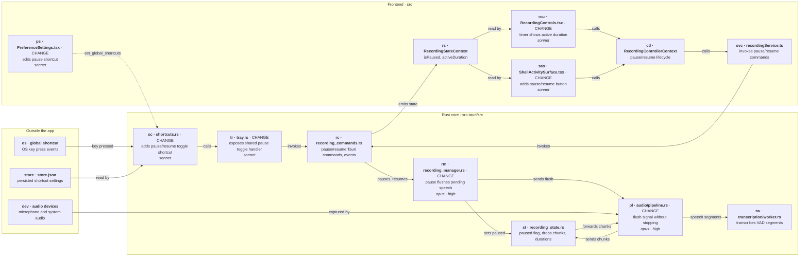

```mermaid
flowchart LR
  subgraph ext["Outside the app"]
    os["<b>os · global shortcut</b><br/>OS key press events"]
    dev["<b>dev · audio devices</b><br/>microphone and system audio"]
    store["<b>store · store.json</b><br/>persisted shortcut settings"]
  end

  subgraph rust["Rust core · src-tauri/src"]
    sc["<b>sc · shortcuts.rs</b> · CHANGE<br/>adds pause/resume toggle shortcut<br/><i>sonnet</i>"]
    tr["<b>tr · tray.rs</b> · CHANGE<br/>exposes shared pause toggle handler<br/><i>sonnet</i>"]
    rc["<b>rc · recording_commands.rs</b><br/>pause/resume Tauri commands, events"]
    rm["<b>rm · recording_manager.rs</b> · CHANGE<br/>pause flushes pending speech<br/><i>opus · high</i>"]
    st["<b>st · recording_state.rs</b><br/>paused flag, drops chunks, durations"]
    pl["<b>pl · audio/pipeline.rs</b> · CHANGE<br/>flush signal without stopping<br/><i>opus · high</i>"]
    tw["<b>tw · transcription/worker.rs</b><br/>transcribes VAD segments"]
  end

  subgraph ui["Frontend · src"]
    svc["<b>svc · recordingService.ts</b><br/>invokes pause/resume commands"]
    ctl["<b>ctl · RecordingControllerContext</b><br/>pause/resume lifecycle"]
    rs["<b>rs · RecordingStateContext</b><br/>isPaused, activeDuration"]
    rcu["<b>rcu · RecordingControls.tsx</b> · CHANGE<br/>timer shows active duration<br/><i>sonnet</i>"]
    sas["<b>sas · ShellActivitySurface.tsx</b> · CHANGE<br/>adds pause/resume button<br/><i>sonnet</i>"]
    ps["<b>ps · PreferenceSettings.tsx</b> · CHANGE<br/>edits pause shortcut<br/><i>sonnet</i>"]
  end

  os -->|"key pressed"| sc
  store -->|"read by"| sc
  sc -->|"calls"| tr
  tr -->|"invokes"| rc
  ps -.->|"set_global_shortcuts"| sc
  rcu -->|"calls"| ctl
  sas -->|"calls"| ctl
  ctl -->|"calls"| svc
  svc -->|"invokes"| rc
  rc -->|"pauses, resumes"| rm
  rm -->|"sets paused"| st
  rm -->|"sends flush"| pl
  dev -->|"captured by"| pl
  pl -->|"sends chunks"| st
  st -->|"forwards chunks"| pl
  pl -->|"speech segments"| tw
  rc -->|"emits state"| rs
  rs -->|"read by"| rcu
  rs -->|"read by"| sas
```
