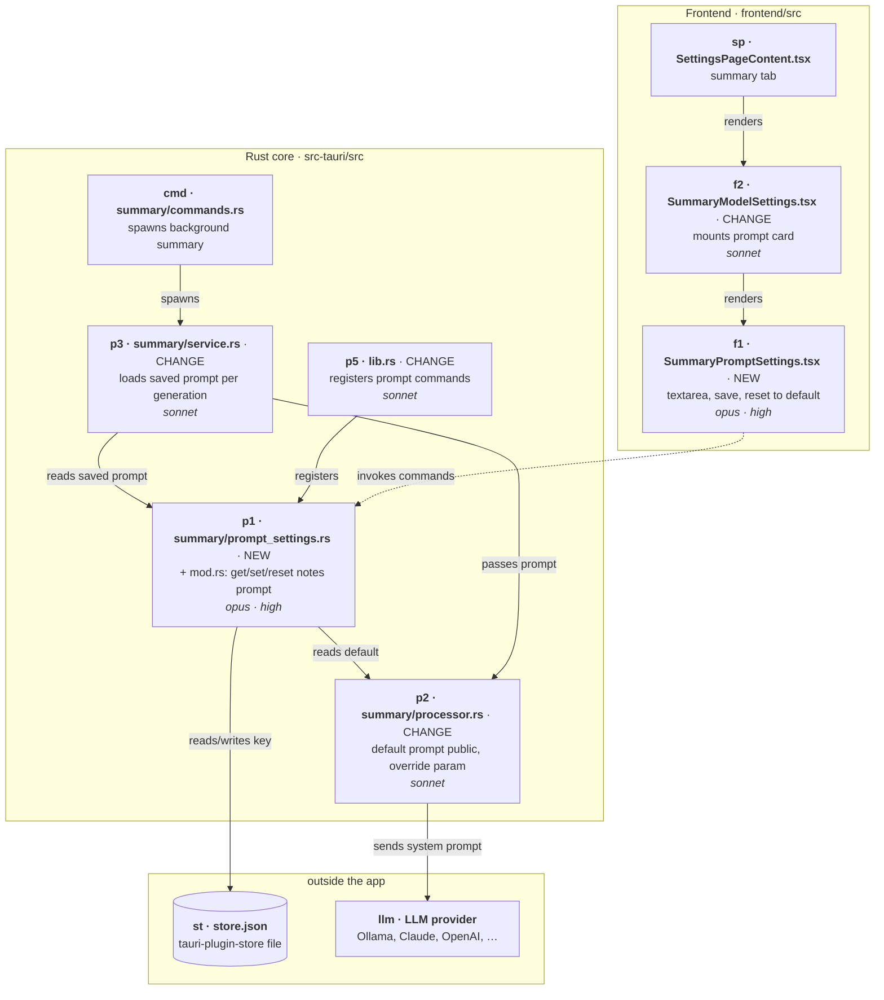

```mermaid
flowchart TD
  subgraph ext["outside the app"]
    st[("<b>st · store.json</b><br/>tauri-plugin-store file")]
    llm["<b>llm · LLM provider</b><br/>Ollama, Claude, OpenAI, …"]
  end
  subgraph rust["Rust core · src-tauri/src"]
    p2["<b>p2 · summary/processor.rs</b> · CHANGE<br/>default prompt public, override param<br/><i>sonnet</i>"]
    p1["<b>p1 · summary/prompt_settings.rs</b> · NEW<br/>+ mod.rs: get/set/reset notes prompt<br/><i>opus · high</i>"]
    p3["<b>p3 · summary/service.rs</b> · CHANGE<br/>loads saved prompt per generation<br/><i>sonnet</i>"]
    p5["<b>p5 · lib.rs</b> · CHANGE<br/>registers prompt commands<br/><i>sonnet</i>"]
    cmd["<b>cmd · summary/commands.rs</b><br/>spawns background summary"]
  end
  subgraph ui["Frontend · frontend/src"]
    f1["<b>f1 · SummaryPromptSettings.tsx</b> · NEW<br/>textarea, save, reset to default<br/><i>opus · high</i>"]
    f2["<b>f2 · SummaryModelSettings.tsx</b> · CHANGE<br/>mounts prompt card<br/><i>sonnet</i>"]
    sp["<b>sp · SettingsPageContent.tsx</b><br/>summary tab"]
  end
  p1 -->|"reads default"| p2
  p1 -->|"reads/writes key"| st
  p3 -->|"reads saved prompt"| p1
  p3 -->|"passes prompt"| p2
  cmd -->|"spawns"| p3
  p2 -->|"sends system prompt"| llm
  p5 -->|"registers"| p1
  f1 -.->|"invokes commands"| p1
  f2 -->|"renders"| f1
  sp -->|"renders"| f2
```
