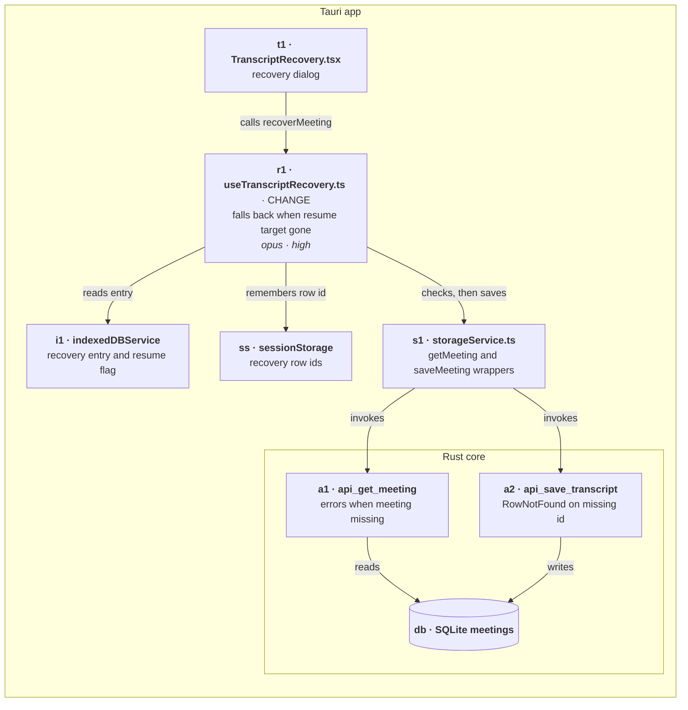

```mermaid
flowchart LR
  subgraph app["Tauri app"]
    r1["<b>r1 · useTranscriptRecovery.ts</b> · CHANGE<br/>falls back when resume target gone<br/><i>opus · high</i>"]
    s1["<b>s1 · storageService.ts</b><br/>getMeeting and saveMeeting wrappers"]
    i1["<b>i1 · indexedDBService</b><br/>recovery entry and resume flag"]
    ss["<b>ss · sessionStorage</b><br/>recovery row ids"]
    t1["<b>t1 · TranscriptRecovery.tsx</b><br/>recovery dialog"]
    subgraph rust["Rust core"]
      a1["<b>a1 · api_get_meeting</b><br/>errors when meeting missing"]
      a2["<b>a2 · api_save_transcript</b><br/>RowNotFound on missing id"]
      db[("<b>db · SQLite meetings</b>")]
    end
  end
  t1 -->|"calls recoverMeeting"| r1
  r1 -->|"reads entry"| i1
  r1 -->|"remembers row id"| ss
  r1 -->|"checks, then saves"| s1
  s1 -->|"invokes"| a1
  s1 -->|"invokes"| a2
  a1 -->|"reads"| db
  a2 -->|"writes"| db
```
