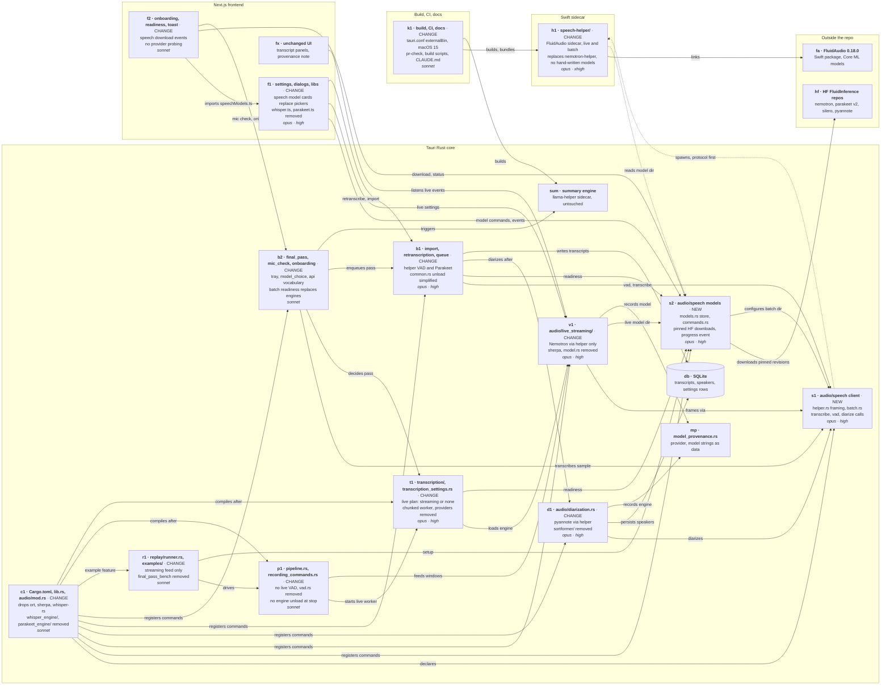

```mermaid
flowchart LR
  subgraph ext["Outside the repo"]
    fa["<b>fa · FluidAudio 0.18.0</b><br/>Swift package, Core ML models"]
    hf["<b>hf · HF FluidInference repos</b><br/>nemotron, parakeet v2, silero, pyannote"]
  end
  subgraph helper["Swift sidecar"]
    h1["<b>h1 · speech-helper/</b> · CHANGE<br/>FluidAudio sidecar, live and batch<br/>replaces nemotron-helper, no hand-written models<br/><i>opus · xhigh</i>"]
  end
  subgraph rust["Tauri Rust core"]
    s1["<b>s1 · audio/speech client</b> · NEW<br/>helper.rs framing, batch.rs<br/>transcribe, vad, diarize calls<br/><i>opus · high</i>"]
    s2["<b>s2 · audio/speech models</b> · NEW<br/>models.rs store, commands.rs<br/>pinned HF downloads, progress event<br/><i>opus · high</i>"]
    v1["<b>v1 · audio/live_streaming/</b> · CHANGE<br/>Nemotron via helper only<br/>sherpa, model.rs removed<br/><i>opus · high</i>"]
    t1["<b>t1 · transcription/, transcription_settings.rs</b> · CHANGE<br/>live plan: streaming or none<br/>chunked worker, providers removed<br/><i>opus · high</i>"]
    p1["<b>p1 · pipeline.rs, recording_commands.rs</b> · CHANGE<br/>no live VAD, vad.rs removed<br/>no engine unload at stop<br/><i>sonnet</i>"]
    b1["<b>b1 · import, retranscription, queue</b> · CHANGE<br/>helper VAD and Parakeet<br/>common.rs unload simplified<br/><i>opus · high</i>"]
    b2["<b>b2 · final_pass, mic_check, onboarding</b> · CHANGE<br/>tray, model_choice, api vocabulary<br/>batch readiness replaces engines<br/><i>sonnet</i>"]
    d1["<b>d1 · audio/diarization.rs</b> · CHANGE<br/>pyannote via helper<br/>sortformer/ removed<br/><i>opus · high</i>"]
    r1["<b>r1 · replay/runner.rs, examples/</b> · CHANGE<br/>streaming feed only<br/>final_pass_bench removed<br/><i>sonnet</i>"]
    c1["<b>c1 · Cargo.toml, lib.rs, audio/mod.rs</b> · CHANGE<br/>drops ort, sherpa, whisper-rs<br/>whisper_engine/, parakeet_engine/ removed<br/><i>sonnet</i>"]
    mp["<b>mp · model_provenance.rs</b><br/>provider, model strings as data"]
    sum["<b>sum · summary engine</b><br/>llama-helper sidecar, untouched"]
    db[("<b>db · SQLite</b><br/>transcripts, speakers, settings rows")]
  end
  subgraph ui["Next.js frontend"]
    f1["<b>f1 · settings, dialogs, libs</b> · CHANGE<br/>speech model cards replace pickers<br/>whisper.ts, parakeet.ts removed<br/><i>opus · high</i>"]
    f2["<b>f2 · onboarding, readiness, toast</b> · CHANGE<br/>speech download events<br/>no provider probing<br/><i>sonnet</i>"]
    fx["<b>fx · unchanged UI</b><br/>transcript panels, provenance note"]
  end
  subgraph build["Build, CI, docs"]
    k1["<b>k1 · build, CI, docs</b> · CHANGE<br/>tauri.conf externalBin, macOS 15<br/>pr-check, build scripts, CLAUDE.md<br/><i>sonnet</i>"]
  end
  h1 -->|"links"| fa
  h1 -.->|"reads model dir"| s2
  s2 -->|"downloads pinned revisions"| hf
  s1 -.->|"spawns, protocol first"| h1
  s2 -->|"configures batch dir"| s1
  v1 -->|"frames via"| s1
  v1 -->|"live model dir"| s2
  v1 -->|"records model"| mp
  t1 -->|"loads engine"| v1
  t1 -->|"readiness"| s2
  p1 -->|"starts live worker"| t1
  p1 -->|"feeds windows"| v1
  b1 -->|"vad, transcribe"| s1
  b1 -->|"readiness"| s2
  b1 -->|"diarizes after"| d1
  b1 -->|"writes transcripts"| db
  b2 -->|"transcribes sample"| s1
  b2 -->|"decides pass"| t1
  b2 -->|"enqueues pass"| b1
  b2 -->|"triggers"| sum
  d1 -->|"diarizes"| s1
  d1 -->|"persists speakers"| db
  d1 -->|"records engine"| mp
  r1 -->|"drives"| p1
  r1 -->|"setup"| s2
  c1 -->|"declares"| s1
  c1 -->|"registers commands"| s2
  c1 -->|"registers commands"| v1
  c1 -->|"registers commands"| d1
  c1 -->|"registers commands"| b1
  c1 -->|"registers commands"| b2
  c1 -->|"example feature"| r1
  c1 -->|"compiles after"| p1
  c1 -->|"compiles after"| t1
  f1 -->|"model commands, events"| s2
  f1 -->|"live settings"| v1
  f1 -->|"retranscribe, import"| b1
  f2 -->|"imports speechModels.ts"| f1
  f2 -->|"download, status"| s2
  f2 -->|"mic check, onboarding"| b2
  fx -->|"listens live events"| v1
  k1 -->|"builds, bundles"| h1
  k1 -->|"builds"| sum
```
